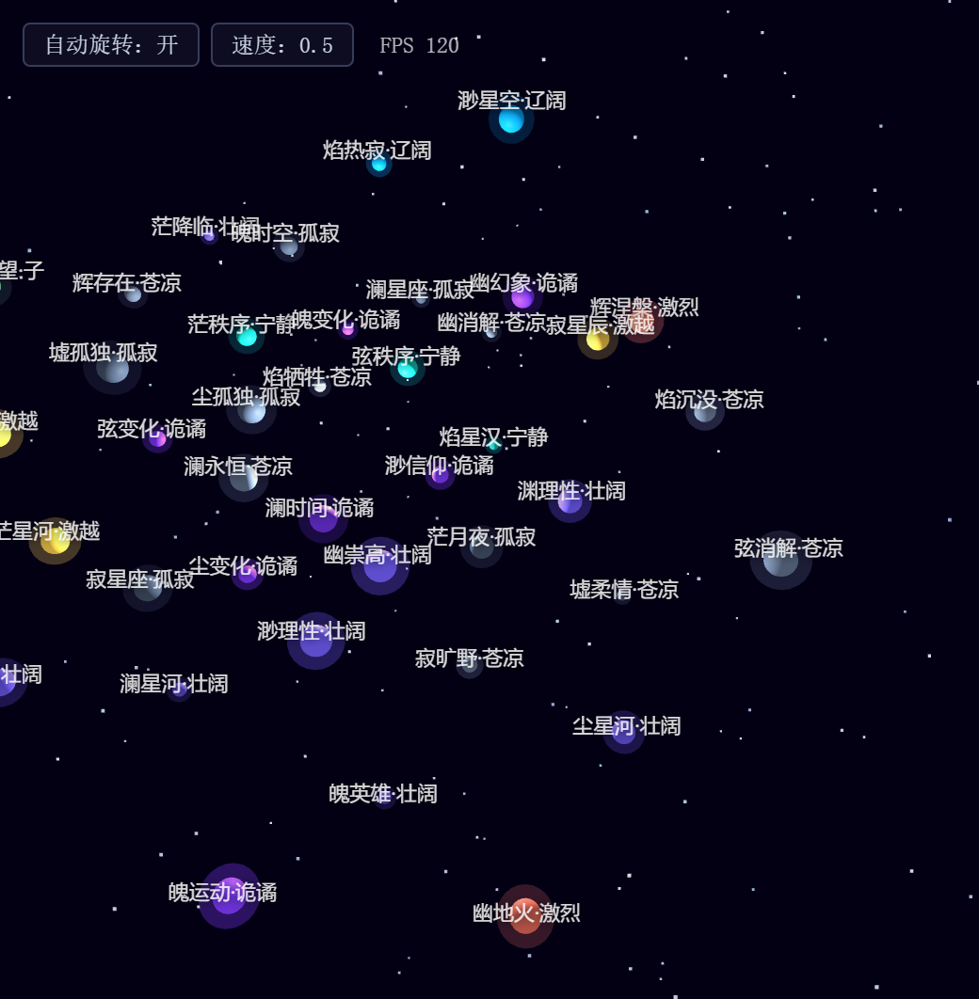
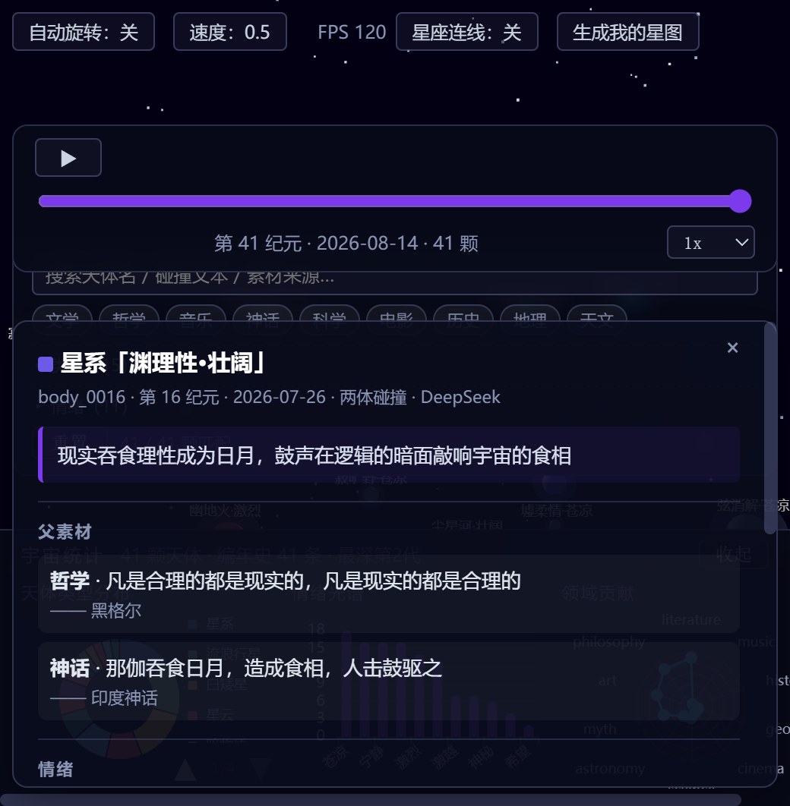

# 私宇宙 · Private Cosmos

> 由 AI 语义碰撞引擎驱动的生成式宇宙——每一次碰撞，诞生一颗天体。



线上体验：**https://yi-shanzhou.github.io/private-cosmos/**（GitHub Pages 自动部署，每日 UTC 定时演化）

## 这是什么

「私宇宙」把 9 大领域（文学、哲学、音乐、神话、科学、电影、历史、地理、天文）的素材两两/三体碰撞，经 DeepSeek（或本地模板降级）生成一颗带有碰撞文本、情绪标签与视觉参数的天体，并在 3D 星图中螺旋展开。宇宙每天自动演化，也会为你的名字生成专属星座。

## 功能总览

| 模块 | 说明 |
|---|---|
| 3D 星图 | three.js 渲染，800 粒子深空 + 天体球体/光晕/名称标签，~120fps |
| 交互 | 轨道旋转/缩放/平移、自动旋转、悬停高亮（30ms 节流 raycast）、点击详情面板 |
| 详情面板 | 碰撞文本、父素材与出处、情绪/主题/领域标签、世代谱系、视觉参数 |
| 统计面板 | ECharts 类型饼图 / 情绪柱状图 / 领域雷达（数据驱动） |
| 时间轴回放 | 纪元滑块 + 播放（450ms 淡入动画）+ 0.5x/1x/2x 速度 |
| 搜索筛选 | 关键词（名称/碰撞文本/类型/素材）+ 领域/类型/情绪多选，URL hash 持久化 |
| 星座连线 | 共享父素材 / 共享主导情绪的连线（≤50 条，strength 排序），悬停高亮两端 |
| 个人星图 | 姓名哈希（FNV-1a+mulberry32）确定性生成 3-5 颗专属星座，PNG 保存与分享链接 |
| PWA | manifest + Service Worker（31 项预缓存，three 全本地化），**真实离线可用** |



## 架构

```
private-cosmos/
├── engine/            # Python 演化引擎（11 模块：素材加载/配对/碰撞/视觉/编年史/日报…）
│   └── evolve.py      # CLI: --count N --dry-run --force-mode {dual,triple,lineage} --seed
├── data/              # cosmos.json(58+) chronicle.json daily_reports.json 领域素材库
├── scripts/
│   └── export_data.py # 导出 web/assets/cosmos-data.js（五个全局变量）+ 自动 bump SW 缓存版本
├── web/               # 纯静态前端（无构建步骤）
│   ├── index.html     # importmap → 本地 three
│   ├── assets/        # 9 个模块：skymap-core/bodies/controls/panel/charts/timeline/search/constellation/personal
│   ├── css/base.css   # 全局样式 + 768px 响应式
│   ├── manifest.json / sw.js / assets/icons/
│   └── _shared/       # echarts + three@0.160.0 本地化 + 字体
└── .github/workflows/ # daily-evolve（每日演化+部署）/ deploy-pages（推送即部署）
```

## 本地运行

```bash
cd web
python -m http.server 8123        # 需 HTTP（Service Worker/ES modules 不支持 file://）
# 打开 http://127.0.0.1:8123/index.html
```

演化与导出：

```bash
python engine/evolve.py --count 3          # 演化 3 颗天体（--dry-run 只读）
python scripts/export_data.py              # 导出前端数据 + bump SW 缓存版本
```

需要 DeepSeek 真实碰撞时在 `.env` 配置 `DEEPSEEK_API_KEY`（缺省自动降级本地模板）。

## 质量与验证

- 每个模块经独立验证（浏览器实测取证 + 数据交叉重算），完整检验报告见项目外「任务验证者」档案
- Lighthouse：Accessibility 92 / Best Practices 96（Performance 因 WebGL + 模拟节流按替代口径：实测 120fps）
- 离线可用性经"停服实测"验证（阶段 A/B 双取证）

## License

MIT（three.js/echarts 各自遵循其开源协议）
